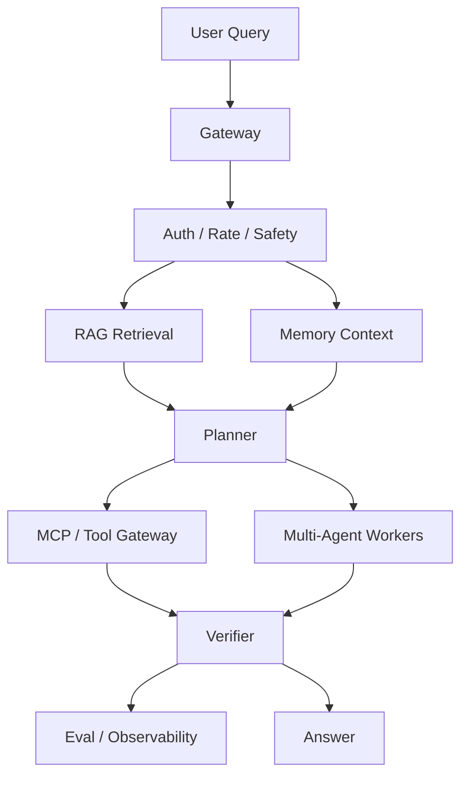

# RAG、记忆、多 Agent、MCP 数据流

生产 Agent 系统通常组合多个子系统。理解数据流比命名框架更重要。RAG、记忆、多 Agent 编排与 MCP 不是互相竞争的选项；它们是同一系统的不同存储层与路由层，其行为由数据如何在它们之间流动来定义。

## 定义

每个子系统回答一个问题：

- **RAG** 回答：*当前的、事实性的证据存在哪里？* 它在查询时检索文档，并把回答扎根于来源。
- **记忆** 回答：*随着时间推移，我们对这个用户、任务或组织了解什么？* 它在会话之间持久化长期上下文。
- **多 Agent 编排** 回答：*这块工作由谁来做？* 它在单循环、并行工人、监督者或验证者之间做选择。
- **MCP（模型上下文协议）** 回答：*我们如何安全地暴露工具与数据源？* 它标准化工具服务器接口、权限与发现机制。

是数据流——而不是组件——构成了系统的契约。如果流程错了，加上更好的组件只会让失败更快。

## 流程

1. 用户 query 进入 gateway。
2. Gateway 检查 auth、rate、safety。
3. RAG 为当前任务检索相关文档。
4. 记忆提供持久的用户、任务或组织上下文。
5. Planner 选择正确的 tool、subagent 或 answer path。
6. MCP 或 tool gateway 暴露工具与外部数据源。
7. 多 Agent 组件分解、验证或专门化处理工作。
8. Evaluation 和 observability 记录质量、延迟、成本和安全信号。

## 为什么流程重要（第一性原理）

控制循环有三个价值来源和三个失败来源，而失败遵循流程的顺序：

1. **证据胜过记忆，记忆胜过猜测**：刚检索到的文档应当压过过期的记忆，而过期记忆应当压过模型的内部心智模型。
2. **权限必须在执行时强制**：如果工具网关在调用发生时没有检查权限，规划器的意图毫无意义。
3. **验证是世界改变前的最后机会**：验证器之后，回答就变成执行器输入；到达这一步的错误要么进入回答，要么进入动作。

失败顺序很重要：如果检索错了，下游的一切——计划、工具、回答——都会继承这个错误。这就是生产排查按流程自上而下检查的原因。

## 数据归属

| 来源 | 负责 | 风险 | 正确问题 |
| --- | --- | --- | --- |
| RAG | 当前问题的检索证据 | 过期或不相关文档 | 检索是否返回了本次 query 需要的 source？ |
| 记忆 | 持久的用户或任务上下文 | 隐私、过期事实、过度泛化 | 这个 fact 应该保存、删除还是遗忘？ |
| 工具网关 | 外部动作与状态 | 权限错误、副作用 | 这是 read、write 还是 destructive？ |
| 规划器 | 步骤选择与路由 | 错误路由、死循环、过度自信 | 下一步是否是最小有用步骤？ |
| 可观测性 | trace、成本、延迟、错误 | trace 不完整、字段缺失 | 能否从 trace 复现 incident？ |

## 设计规则

- 把检索范围限定在问题本身。
- 把记忆当作隐私敏感数据对待。
- 让子 Agent 的职责显式化。
- 谨慎记录工具的输入与输出。
- 用评估集捕捉回归。
- 把证据与生成的文本分离。
- 不要让最终回答隐藏缺失的来源。
- 优先使用在执行时强制权限的工具网关。
- 把子 Agent 输出当作可能需要验证的证据。

## 关键权衡

| 权衡 | 倾向哪边 | 注意什么 |
| --- | --- | --- |
| RAG 广度 vs. 精度 | 针对问题窄检索 | 过宽检索让答案淹没在噪音里 |
| 记忆持久化 vs. 隐私 | 少存多删 | 每一条被存下的事实都是未来的隐私事件 |
| 单规划器 vs. 多 Agent | 先单 | 多 Agent 复杂度需要价值证据 |
| 工具协议合规 vs. 速度 | 合规优先 | 自定义协议是对 MCP 的拙劣重造 |
| 验证深度 vs. 延迟 | 验证动作、抽样回答 | 每个回答都做全面验证可能太慢 |

## MCP 在流程中的位置

MCP 位于规划器与工具之间。它解决每个朴素工具集成都会遇到的三个问题：

- **标准化接口**：一个客户端协议对接许多服务器，而不是在 Agent 循环里拼接 N 个自定义 SDK。
- **边界强制**：工具契约归服务器所有，而不是模型——参数、校验与失败模式在工具所在之处定义。
- **运维控制**：工具在提示词之外被版本化、列出和限流，团队可以在不改动提示词的情况下调整工具面。

对流程的含义：MCP 不会让工具变安全。它让工具面可被检查，而可检查性是权限检查、审计与评估的前提。

## 多 Agent 组件在流程中的位置

多 Agent 编排不是风格选择，而是有严格条件的路由决策。在以下情况使用分解：

- 任务有清晰可分的子任务，且各自有自己的工具。
- 并行工人降低的墙钟延迟大于它们增加的协调开销。
- 验证者或评审者必须独立于产出者。
- 工作流需要不同的技能模型或专门上下文。

当任务只是单循环、分解是被发明出来的、或协调（消息传递、状态共享、错误传播）的成本超过并行节省时，应避免多 Agent 编排。一个只转发消息的监督者是延迟税，不是架构。

## 失败排查

当答案错误时，按这个顺序检查：

1. 用户请求是否信息足够？
2. Retrieval 是否返回正确 source？
3. 记忆是否引入 stale/private context？
4. Planner 是否选择正确路径？
5. Tool 是否执行正确动作？
6. Verification 是否在回答前捕获错误？
7. Trace 是否完整到可复现？

## 生产实践

- 给每个子系统独立的评估集与指标，让回归能定位到引发它的那一层。
- 跨层追踪流程标记：检索 id、记忆读取 id、工具调用 id、Agent id——join 成同一条请求 trace。
- 独立版本化检索索引与工具面；回滚于是有了按层的目标。
- 把检索与工具载荷保留一个窗口期，让复盘能回放精确输入。
- 运行合成"投毒来源"测试：让一个来源变过期，确认系统停止信任它。
- 对流程级不变量告警——证据新鲜度、权限拒绝、未答复的检索——而不只是答案级准确率。

## 与相邻概念的关系

- 该流程是 [`Agent系统蓝图.md`](Agent系统蓝图.md) 架构图的运行时视图。
- 幻觉正是该流程的验证器要捕获的失败模式，见 [`模型幻觉.md`](模型幻觉.md)。
- 记忆作为子系统有自己的生命周期，见 [`长期记忆.md`](长期记忆.md)。
- MCP 的协议细节在 [`MCP模型上下文协议.md`](MCP模型上下文协议.md)；规划器的决策细节在 [`Plan决策.md`](Plan决策.md)。
- 多 Agent 路由细节见 [`多Agent调度.md`](多Agent调度.md)。

## 系统设计清单

- 系统能不能 refuse？
- 能不能 cite evidence？
- 能不能安全调用 tools？
- 能不能区分 read-only 和 write actions？
- 能不能检测 stale facts？
- 能不能 escalate 到 human？
- 能不能 rollback 或 disable risky path？
- 每个子系统能否独立评估？

## 自测题

1. **问：为什么数据流比组件选择更重要？**
   答：流程定义了优先级与失败传播：证据胜过记忆、权限在执行时强制、验证发生在世界改变之前。组件只有在正确的流程位置上才起作用。

2. **问：MCP 到底给流程增加了什么？**
   答：它标准化工具服务器接口，并把版本化、列出、限流等运维控制放在提示词之外。它不让工具变安全，而是让工具面可检查到足以强制安全。

3. **问：什么时候应避免多 Agent 分解？**
   答：当任务只是单循环、分解是被发明的、或协调开销超过并行节省时。一个只转发消息的监督者是延迟税。

4. **问：为什么权限必须在执行时强制？**
   答：因为规划意图不是权限决策。工具网关是实际调用、主体与当前政策三者唯一汇聚之处；提示词里的检查是建议性的，网关里的检查才是强制的。

5. **问：失败排查时第一件要检查的事是什么？为什么？**
   答：用户请求是否信息足够。每个下游产物都继承上游的错误；如果请求本身模糊或不完整，任何子系统都无法修复它。
