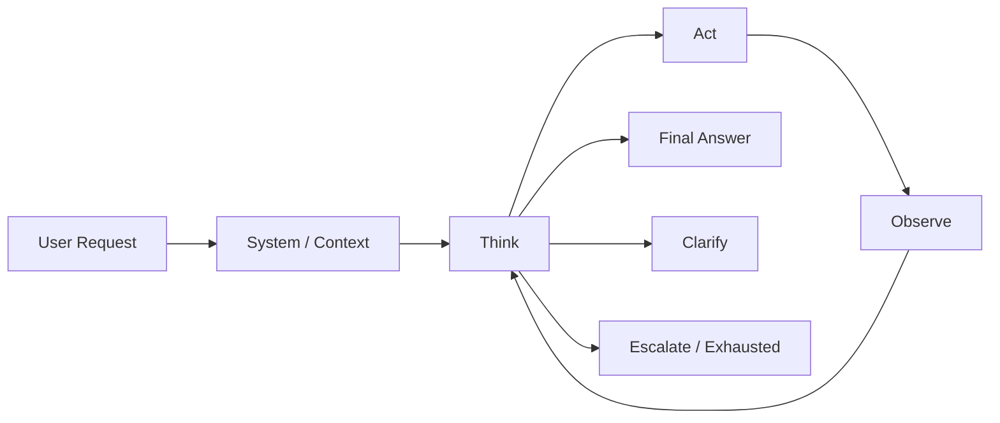
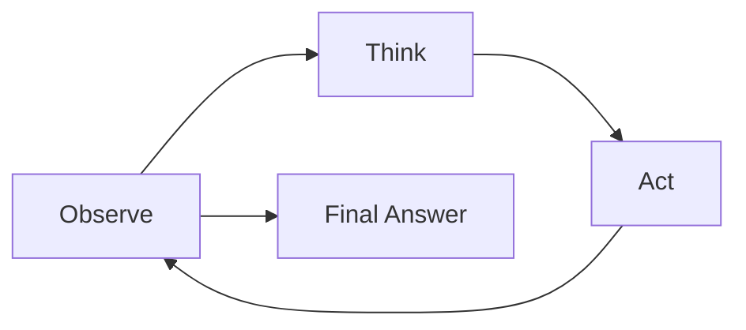
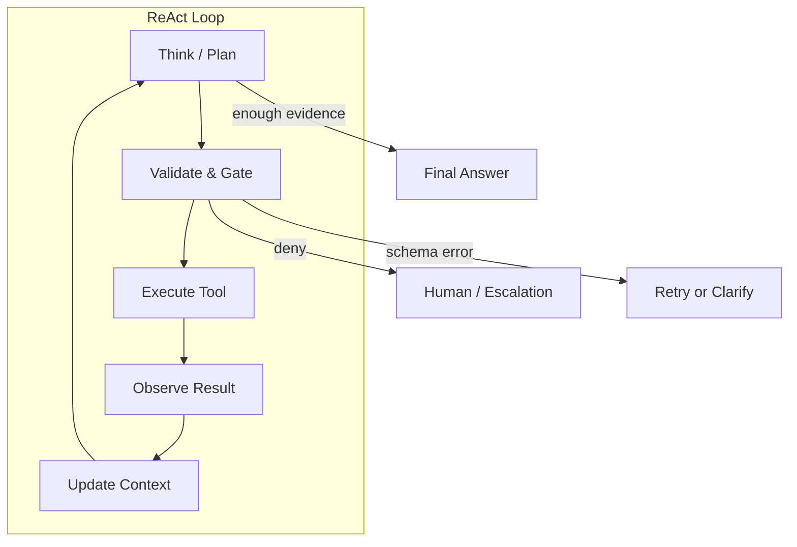

# ReAct 模式

ReAct（Reasoning + Acting）把推理轨迹与工具动作交织在一起：模型先对当前状态进行推理，然后行动，再观察，再推理。它是值得最先学习的模式之一，因为它暴露了 Agent 的活动部件——上下文、规划、工具使用、观察与停止条件——而不需要任何框架。

## 基本定义

ReAct 循环是一个有限的三步重复：

1. **推理（Reason）** —— 模型说明它知道什么、需要什么、下一步试什么。
2. **行动（Act）** —— 系统代表模型执行一次经过校验的工具调用。
3. **观察（Observe）** —— 工具结果作为新证据回到循环中。

循环在模型产出最终答案、请求模糊、某一步不安全、或资源预算耗尽时结束。



## 为什么重要：第一性原理

设计源于一个事实：模型不是执行者，而是提议者。模型无法验证自己的论断、不知道哪些工具存在、也无法执行权限控制。必须有模型之外的东西——即循环——把推理与世界连接起来并返回。

由此推出三个结论：

- **真理是构建出来的，不是断言出来的。** 一个论断只有在工具或检索的证据支持之后才可靠。
- **控制权在模型之外。** 由系统决定什么上下文进入、哪些动作被允许、何时停止。
- **每个循环都需要终止与审计。** 没有限制，循环会烧掉 token；没有日志，失败无法复现。

这些原则也解释了为什么在课程里 ReAct 要先于框架：循环是骨架，任何框架都只是同一骨架的托管版本。

## 最小循环

1. 观察当前状态。
2. 思考下一步。
3. 需要时调用工具。
4. 观察工具结果。
5. 重复直到答案完整、模糊、不安全或预算耗尽。



## 伪代码

```python
state = observe(user_request)
for step in range(max_steps):
    thought, action = think(state)
    if action == "answer":
        return thought.answer
    observation = call_tool(action)
    state = update(state, observation)
return clarify_or_escalate(state)
```

生产变体把推理与工具选择分开，以便循环可以被测试和门控：

```python
for step in range(max_steps):
    thought = reason(state, history)
    next_action = choose_action(thought, available_tools)  # validated by the system
    if next_action.kind == "answer":
        return next_action.content
    observation = execute_tool(next_action)               # schema-validated, permission-checked
    history.append((next_action, observation))
```

## ReAct 让什么变得明确

- 模型不直接控制一切；系统在控制。
- 工具结果是观察（observations），不是真理。
- 循环需要停止条件。
- 失败或模糊的动作应改变计划。
- 最终答案只在证据充分时才应产生。

## 架构与数据流



| 组件 | 职责 | 示例 |
| --- | --- | --- |
| 上下文构建器 | 决定什么进入 prompt | 当前任务、历史、检索文档 |
| 推理器 | 产出下一步或最终答案 | LLM |
| 动作校验器 | 检查 schema、权限、安全 | JSON Schema + 白名单 |
| 执行器 | 运行工具 | 函数调用、MCP server |
| 观察器 | 把工具输出规范化为上下文 | 截断、摘要、打标签 |
| 循环控制器 | 强制执行限制与停止规则 | 最大步数、token 预算、截止时间 |

## 权衡

| 权衡 | ReAct | 替代方案 |
| --- | --- | --- |
| 可调试性 | 高：每一步都是可读的 thought + action | 黑盒 chain-of-thought（无动作） |
| 工具耦合 | 低：工具插进简单循环 | 框架内部抽象 |
| 效率 | 较低：每步推理 token 会累积 | Plan-then-execute 一次计划后执行 |
| 延迟 | 较高：串行推理 + 工具调用 | 并行工具扇出（多 Agent 或批量） |
| 复杂度 | 最小：无 planner、无子 Agent | 分层 planner、supervisor 图 |
| 失败模式 | 循环、重复犯错 | 计划过时、子任务僵化 |

实用规则：任务小、工具少、可调试性比 token 成本更重要时，ReAct 是对的。只有 ReAct 循环太长、太贵或太重复时，才引入规划或多 Agent 结构。

## 停止条件

ReAct 循环应在以下情况停止：

- 答案已就绪。
- 用户请求模糊。
- 工具调用不安全。
- 同一工具反复失败。
- 达到步数上限。
- 缺少必需证据。

## 为循环设计工具

工具是循环的感官与手，因此工具质量决定循环质量：

- 每个工具保持小巧：一个清晰动作、带类型的输入、显式输出。
- 让错误可机器读取：`{"ok": false, "error": "...", "code": 404}` 而不是散文。
- 显式返回空结果（`no results`），避免模型凭空编造内容。
- 永不在工具描述中放密钥或凭据。
- 在输出中区分「未找到」与「无权限」。

## 常见错误

- 让模型在无 schema 校验的情况下调用工具。
- 把空工具结果当作成功完成。
- 没有最大步数限制。
- 隐藏推理过程，无法审计。
- 在不清楚该放什么的情况下加记忆。
- 在同一个失败工具上循环，而不切换策略。
- 输出过长的工具结果，挤占原始任务。

## 生产备注

生产级 ReAct 系统需要：

- 记录每个 thought/action 对。
- 发出 tool call ID。
- 强制 per-tool 权限。
- 跟踪每步 token 与延迟成本。
- 为循环失败添加回归评估。
- 设置每请求预算：最大步数、最大 token、墙钟截止时间。
- 每一步都把原始用户请求保留在上下文中。
- 工具结果在重新进入 prompt 前截断或摘要。

```python
# 最小生产护栏：停止条件与预算
def run_loop(user_request, tools, *, max_steps=8, max_tokens=4000, deadline=None):
    history = []
    for step in range(max_steps):
        if elapsed(deadline): return escalate("deadline exceeded")
        thought = reason(user_request, history, tokens_left=max_tokens)
        if thought.is_answer(): return finalize(thought)
        action = validate_schema(thought.action, tools)
        if not action.valid: return clarify(history)
        if not authorize(action): return deny(action)
        observation = execute(action, timeout=30)
        history.append((action, observation))
    return escalate("step limit reached")
```

## 一个完整的最小示例：小型工具集

一个带三个工具——search、read、answer——的最小生产循环，展示各部件如何组合。

```python
import json
from dataclasses import dataclass

@dataclass
class Tool:
    name: str
    schema: dict
    fn: callable

def search_docs(query: str) -> str:
    # 真实实现查询索引；示例保持简单。
    return json.dumps({"ok": True, "results": ["refund-policy.md", "faq-refund.md"]})

def read_file(path: str) -> str:
    return json.dumps({"ok": True, "content": "Refunds are processed within 5 business days."})

TOOLS = {
    "search_docs": Tool("search_docs", {"type": "object", "properties": {"query": {"type": "string"}}}, search_docs),
    "read_file": Tool("read_file", {"type": "object", "properties": {"path": {"type": "string"}}}, read_file),
}

def call_tool(name: str, args: dict):
    tool = TOOLS.get(name)
    if tool is None:
        return {"ok": False, "error": "unknown_tool"}
    if not valid_against_schema(args, tool.schema):
        return {"ok": False, "error": "schema_error"}
    return tool.fn(**args)
```

循环然后交替思考和调用 `call_tool`，把每个 `(action, observation)` 对追加到 `history`，并在 `answer` 或步数预算用尽时停止。这就是 ReAct 的全部核心：其余一切——记忆、RAG、MCP——都以工具或上下文的形式插进这个骨架。

## 评估一个 ReAct 循环

评估循环而不只是最终答案：

- **终止性：** 在评估集上，循环是否总能在预算内停止？
- **工具选择：** 模型是否为目标选对了工具？
- **参数质量：** 生成的参数是否符合 schema 且符合意图？
- **观察使用：** 最终答案是否引用工具实际返回的内容？
- **恢复能力：** 工具失败后，循环是否合理地重试、切换或升级？
- **安全性：** 被拒绝的动作是否被绕过或未经许可重试？
- **成本：** 每个完成任务的 token 与延迟是否在预算内。

一个有用的回归集包含：正常多步任务、返回空结果的工具、返回错误的工具、返回矛盾证据的工具、被拒绝的权限、步数上限耗尽、以及一开始就模糊的请求。

## 与相邻概念的关系

- **ReAct ↔ 规划：** ReAct 是反应式的，一步一决策。Plan-then-execute 是主动式的：先计划再执行，只在失败时重新规划。计划短用 ReAct；任务长升级为显式规划。
- **ReAct ↔ 记忆：** 记忆必须服务于循环，而不是替代循环。持久事实作为上下文进入；新鲜的（fresh）工具结果在观察中应覆盖过时记忆。
- **ReAct ↔ MCP：** MCP 是循环动作被执行的标准化边界——工具、资源、提示词与权限元数据都成为契约，而不是临时粘合。ReAct 循环消费 MCP 工具 schema，MCP 返回观察。
- **ReAct ↔ 幻觉：** 每次观察都是给论断「接地」（grounding）的机会。跳过验证的循环产生自信但编造的回答；带证据门控的循环把推理变成验证过的输出。
- **ReAct ↔ RAG：** RAG 是循环里的一个工具。检索调用只是一个动作，其观察是文档；相同的校验与新鲜度规则适用。
- **ReAct ↔ 多 Agent：** ReAct 是叶子模式。Supervisor、planner 与 critic 编排 ReAct 风格的 worker；每个 worker 仍然运行一个带边界的循环。

## 自测题

1. **为什么工具调用必须经过 schema 校验？** —— 因为模型是提议者，不是执行者。校验防止畸形参数到达真实系统，并给循环一个「想与做」之间的确定性闸门。
2. **同一工具失败三次后应怎么办？** —— 停止重试该工具，改变策略（换工具、澄清或升级），并把失败记录到 trace 与回归评估中。
3. **空工具结果算成功完成吗？** —— 不算。空或缺失结果必须视为「无证据」，循环要么收集更多证据，要么回答无法验证。
4. **thought 与 action 的区别是什么？** —— thought 是不执行的推理；action 是经过校验、权限检查的调用。只有 action 触达世界，也只有 action 需要审计轨迹。
5. **为什么需要 max-step 与 token 预算？** —— 它们是循环的终止保证。没有它们，循环或过度自信的模型会无限烧 token 并延迟用户答案。

## 参考来源

- ReAct: Synergizing Reasoning and Acting in Language Models: https://arxiv.org/abs/2210.03629
- LangGraph ReAct agent implementation: https://langchain-ai.github.io/langgraph/reference/prebuilt/
