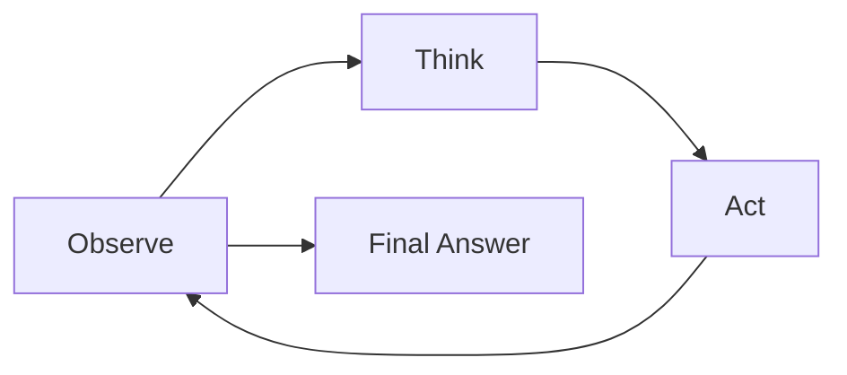

ReAct 模式

ReAct 交替进行 reasoning 和 action。它是先学 Agent 循环的好模式，因为它暴露了 Agent 的组成部分，而不需要框架。

## 最小循环

1. Observe 当前状态。
2. Think 下一步。
3. 必要时 Call a tool。
4. Observe tool result。
5. 重复直到完成、模糊、不安全或耗尽。



## Pseudocode

```python
state = observe(user_request)
for step in range(max_steps):
    thought, action = think(state)
    if action == "answer":
        return thought.answer
    observation = call_tool(action)
    state = update(state, observation)
return clarify_or_escalate(state)
```

## ReAct 让什么变明确

- 模型不直接控制一切，系统控制模型。
- Tool results 是 observations，不是真理。
- Loop 需要 stop conditions。
- Failed 或 ambiguous actions 应改变计划。
- 最终回答应在证据足够时产生。

## Trade-offs

- 简单、可调试。
- 容易教学。
- 工具反馈差时可能循环。
- 需要 max-step limits。
- 需要 tool argument validation。

## 生产备注

- 记录每个 thought/action pair。
- 发出 tool call IDs。
- 执行 per-tool permissions。
- 跟踪每步 token 和 latency cost。
- 为 loop failures 添加 regression evals。

