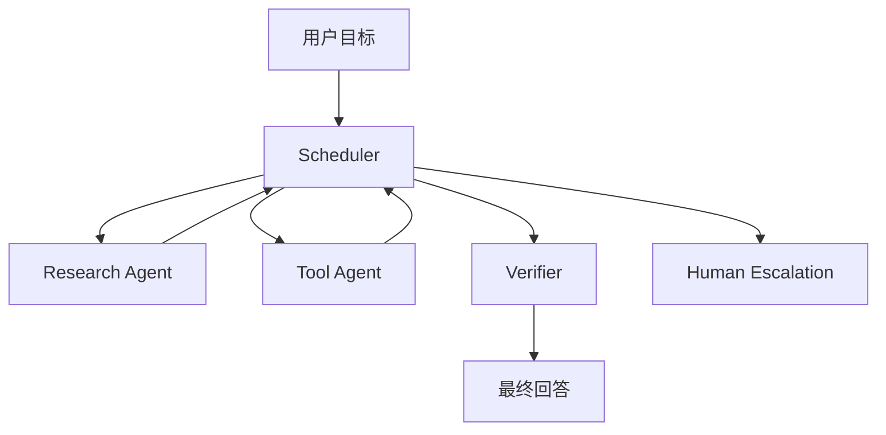

# 多 Agent 调度

多 Agent 调度是决定哪些 agent 运行、按什么顺序运行、带什么输入、以及什么时候停止工作的决策层。

## 调度解决什么问题？

调度把一组专门化 agent 变成受控 workflow。它回答：

- 哪个 agent 负责当前任务？
- 哪些 agent 可以并行？
- 最终回答前必须谁验证？
- 什么时候 retry、stop 或 escalate？
- 如何避免隐藏循环和重复工作？

## 常见拓扑

| Topology | 适用场景 | 风险 |
| --- | --- | --- |
| Supervisor | 需要一个 coordinator 负责路由和状态 | Supervisor 变成黑盒 |
| Pipeline | 阶段固定：plan、retrieve、draft、verify | 阶段失败不可见 |
| Handoff | agent 专门化并传递控制权 | 没有 stop condition |
| Parallel fan-out | 任务可安全拆分 | merge conflict、重复成本 |
| Human route | 高风险或不可逆动作 | 审批流于形式 |

## 调度输入

Scheduler 不应只靠模型偏好，还应考虑：

- 任务类型和风险等级。
- 可用 tools 和 permissions。
- Evidence 是否新鲜。
- Budget：time、tokens、API calls。
- 当前 confidence 和 missing information。
- Safety policy 和人工审批规则。

## 调度输出

- Agent assignment。
- 该 agent 的 input bundle。
- Allowed tools。
- Stop condition。
- Verification requirement。
- Audit event。

## 什么时候不要使用多 Agent？

除非多 Agent 能提升 isolation、verification 或 clarity，否则优先使用带 tools 的单 Agent。多 Agent 会增加协调成本、隐藏状态和调试面。

## 失败模式

- Agent A 和 Agent B 同时写同一个共享状态。
- Supervisor 丢失原始用户目标。
- Verifier 接受弱 evidence。
- 并行 agent 给出冲突答案。
- 系统因为没有最大深度限制而循环。
- Destructive actions 绕过人工审批。

## 评估清单

- 每个 agent 的职责能否解释清楚？
- Scheduler 能否从日志 replay？
- 每个 worker 是否有 stop condition？
- 每个 evidence-heavy answer 是否有 verifier？
- 成本是否有上限？
