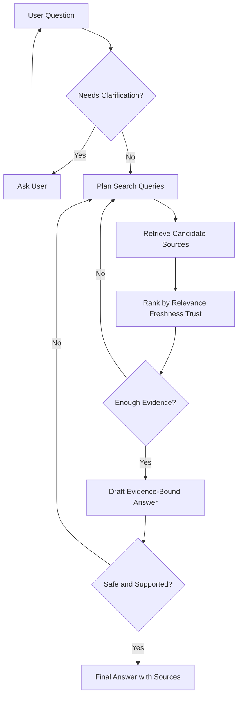

# 多轮研究与讨论流程

多轮研究意味着 Agent 在回答前规划多轮证据收集。多轮讨论意味着 Agent 可以要求澄清、质疑薄弱证据，并在已知足够时停止。

这个流程在 Agent 教程与生产系统中都很常见，因为大多数真实问题都无法从第一轮 prompt 完整回答。

## 为什么多轮很重要

当问题模糊、第一轮检索漏掉了关键来源、证据过期、或最终答案需要高风险动作时，单遍（single-pass）回答会失败。

多轮行为增加了结构：

- 澄清请求。
- 用不止一种查询形态搜索。
- 对来源排序与比较。
- 决定是回答、再搜索、问用户，还是拒绝。
- 解释最终证据边界。

## 参考流程



## 核心概念

### 查询规划

查询规划把一个模糊的用户请求变成若干条寻求证据的查询。

示例：

- 原始提问：“我们应该怎么选 Agent 框架？”
- 规划查询：“框架选择标准”“框架版本新鲜度”“框架失败模式”“框架生产可观测性”。

好的查询规划会改变问题的形态，而不是重复同样的话。

### 来源选择

来源选择检查某个结果是否包含最终论断所需的证据。

有用的维度：

- 相关性：它是否回答了实际的问题？
- 新鲜度：对快速变化的框架或 API 而言，它是否最新？
- 可信度：该来源对论断是否权威？
- 范围：它是否匹配用户的上下文与权限？

### 讨论轮次

一轮讨论可以是以下动作之一：

- 继续搜索。
- 问用户。
- 拒绝薄弱证据。
- 起草答案。
- 验证答案。
- 停止并引用证据。

### 收敛

Agent 应在以下情况停止：

- 所需证据已齐。
- 答案在范围内。
- 过期或矛盾的论断被指出。
- 下一步行动明确。
- 用户已有足够证据做决定。

它不应因为模型自我感觉自信就停止。

## 本地 Lab

参考确定性实现：

- [`../../../labs/l3/multi_round_research_discussion/README.md`](../../../labs/l3/multi_round_research_discussion/README.md)

运行：

```bash
python -m unittest labs.l3.multi_round_research_discussion.test_lab
```

## 生产备注

生产系统还需要：

- 记录每一次查询与来源决策的 trace。
- 记录来源被拒绝的原因。
- 把澄清历史与长期记忆分开存储。
- 评估问用户是否改善了答案。
- 追踪需要多少轮，以及轮次是否让延迟增加过多。

## 常见错误

- 同一个短语搜索五次。
- 把高相关分数当作证明。
- 对框架与 API 话题忽略新鲜度。
- 在证据不足前就用“综合出来的自信”回答。
- 问题已经很具体时还问太多澄清问题。

## 与相邻概念的关系

- [`ReAct模式.md`](ReAct模式.md)：多轮研究是 ReAct 循环在证据收集维度上的扩展。
- [`RAG记忆MCP数据流.md`](RAG记忆MCP数据流.md)：多轮研究中的每一轮检索都遵循检索→证据→接地的数据流。
- [`长期记忆.md`](长期记忆.md)：澄清历史不应混入长期记忆。
- [`Agent概念总览.md`](Agent概念总览.md)：规划、工具与停止条件的宏观背景。
