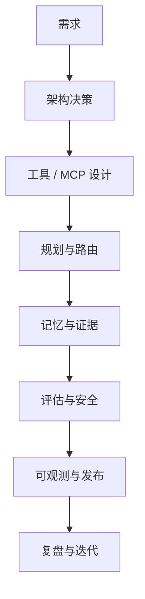

# 核心 Agent 实施手册

这份手册把概念页变成交付路径：需求、架构、实现、评估、发布和复盘。

## 什么时候使用这份手册？

当你需要设计或 review 一个真实 Agent 系统，而不只是解释一个概念时，使用这份手册。

- 构建带工具的可靠单 Agent。
- 设计 RAG、memory、MCP 或 multi-agent flow。
- 增加 evaluation、safety、observability 或 rollback。
- 为面试或作品集准备有真实证据的项目。

## 端到端交付流程

## 1. 需求和范围

先写系统契约。

必填项：

- 主要用户和业务目标。
- 允许的数据源。
- 允许的工具和副作用。
- 禁止动作。
- 成功标准。
- 失败标准。
- 人工升级触发条件。
- 成本和延迟预算。

不要先选框架。先决定最小可靠架构。

## 2. 架构决策

选择能满足需求的简单架构。

| 方案 | 适用场景 | 不适用场景 |
| --- | --- | --- |
| Single LLM call | 无工具、无私有 evidence、无 action | 需要外部状态或 citations |
| Single Agent + tools | 需要工具且 ownership 清楚 | 需要多个 specialist 和 verification |
| RAG Agent | Evidence 来自私有或当前文档 | 来源 stale 或不可信 |
| Multi-agent supervisor | isolation 或 verification 能提升可靠性 | 协调成本不值得 |
| Production Agent | 需要 auth、evals、traces、rollback、预算 | 只是 prototype |

显式记录 trade-off：

- accuracy vs latency；
- cost vs safety；
- autonomy vs human approval；
- framework convenience vs control；
- memory convenience vs privacy。

## 3. 工具和 MCP 设计

每个 tool 或 MCP capability 都要定义：

- Name。
- Purpose。
- Input schema。
- Output schema。
- Error schema。
- Risk class：read、write、destructive。
- Required permissions。
- Idempotency behavior。
- Audit fields。
- Rollback 或 undo path。

最低控制：

- 执行前 validate input；
- 默认 deny；
- 分类 side effects；
- Destructive actions 需要 confirmation；
- 记录 actor、tenant、tool、request ID、result；
- 把 tool output 当 evidence，而不是 authority。

## 4. 规划和路由

先 plan decision，再 action。

Decision event 应包含：

- next action；
- reason；
- expected evidence；
- risk level；
- allowed tools；
- stop condition；
- fallback。

以下情况需要 human approval：

- action 不可逆；
- blast radius 不清楚；
- permissions 模糊；
- repeated tool failure；
- model uncertain 且 confidence 不足以行动。

## 5. 记忆和证据

把 memory 和 evidence 分开。

| 类型 | Source | Trust |
| --- | --- | --- |
| Conversation history | 当前 session | Medium |
| User preference memory | confirmed preference | Medium |
| Tool result | live external system | 可审计时 High |
| Retrieved source | knowledge base 或 RAG | 新鲜且 cited 时 High |
| Model inference | model 生成 | 未验证时 Low |

规则：

- live system of record 优先于 stale memory；
- user corrections 优先于 inferred memory；
- retrieved evidence 优先于 model recall；
- evidence-heavy claims 需要 citations 或可追踪 tool output；
- memory writes 需要 owner、timestamp、source、confidence 和 deletion path。

## 6. 评估和安全

在最终 prompt tuning 前定义 evaluation。

最低 eval classes：

- golden path；
- clarification；
- refusal；
- tool failure；
- stale source；
- hallucination；
- prompt injection；
- permission denied；
- destructive action attempt；
- cost/latency over budget。

Release gate：

- safety failures 阻断发布；
- unsupported factual claims 阻断 action；
- 缺失 trace fields 阻断发布；
- 缺失 rollback plan 阻断发布；
- cost 或 latency 超预算需要 explicit approval。

## 7. 可观测和发布

生产请求必须可追踪。

必填 trace fields：

- request ID；
- user 和 tenant ID；
- model 和 prompt version；
- plan decisions；
- tool calls 和 results；
- retrieved sources；
- memory reads 和 writes；
- guardrail decisions；
- verifier decisions；
- final answer status；
- token cost 和 latency；
- escalation 或 human approval。

Prompts、models、tools、retrieval indexes、memory policies、routers 都需要 rollback plan。

## 8. 复盘和迭代

Incident 或 failed evaluation 后：

- 分类 failure；
- 找出 affected request IDs；
- 记录 root cause；
- 增加 regression eval；
- 增加 guardrail 或 trace field；
- 更新 rollback notes；
- 分配 owner 和 due date。

规则：每个生产 failure 都应该变成 eval、guardrail、trace field、rollback path 或 postmortem action。

## 证据包

Portfolio 或面试时附上：

- design document；
- tool schema 和 risk table；
- trace sample；
- eval report；
- postmortem 或 dry-run postmortem；
- 一个清晰的 trade-off decision。

## 相关页面

- 架构：[`Agent系统架构.md`](Agent系统架构.md)
- 设计审查：[`Agent设计审查清单.md`](Agent设计审查清单.md)
- MCP：[`MCP模型上下文协议.md`](MCP模型上下文协议.md)
- 多 Agent 调度：[`多Agent调度.md`](多Agent调度.md)
- 长期记忆：[`长期记忆.md`](长期记忆.md)
- 幻觉：[`模型幻觉.md`](模型幻觉.md)
- Plan 与决策：[`Plan决策.md`](Plan决策.md)
