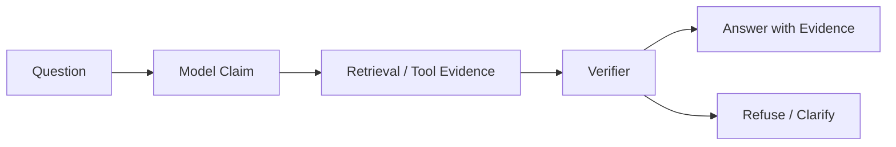

# 模型幻觉

模型幻觉（Model Hallucination）是指大语言模型产出自信、但无依据、错误、过时或凭空捏造的输出。在 Agent 系统中，幻觉之所以危险，是因为下一步可能基于这段生成的内容采取行动——当 Agent 依据"名词幻觉"去调用工具、更新记录或批准决策时，"名词幻觉"就变成了"动词幻觉"。

## 定义

幻觉不是单一故障，而是一族共享同一症状的故障：输出听起来流畅自信，却没有证据支撑。三个特征帮助你识别它：

- **无依据的自信**：模型以很高的语言确定性断言它无法核实的内容。
- **貌似合理压过正确**：输出在内部自洽、风格一致，这让错误很难被发现。
- **上下文敏感**：同一个提示词，会因检索质量、记忆新鲜度和工具结果的不同，时而成功、时而幻觉。

工程师可用的工作定义：*当一个懂行的验证者无法在模型可获得的证据中为某个断言找到支撑时，这个断言就是幻觉。* 这把讨论从哲学问题变成了可测量问题。

## 为什么幻觉重要（第一性原理）

在自回归训练目标下，LLM 学习的是根据训练分布预测下一个 token。它没有内建的真值预言机、没有当前事实数据库、也不与现实世界相连。模型的输出是*条件采样的延续文本*，而不是经过核实的陈述。由此推出：

1. **语言模型优化流畅度而非事实性**：训练信号奖励通顺的文本，因此自信与风格相关，而非与真理相关。
2. **知识冻结在训练截止日**：截止日之后的一切——新 API、新政策、新事故——单靠参数不可能知道。
3. **上下文的好坏取决于检索**：模型区分不了一个事实和喂给它的"事实"。
4. **不确定性被压缩**：下一个 token 的概率不会以可用形式暴露"我不知道"；模型会转而说一句通顺的话。

在 Agent 系统中，这四个属性与"采取行动"结合。模型的任务不再只是产出一段可能正确的文本，而是产出一个系统将要据以行动的断言。这就是幻觉从质量问题变成安全问题的原因。

## 幻觉类型

| 类型 | 描述 | 示例 |
| --- | --- | --- |
| 事实幻觉 | 错误事实或编造的细节 | 声称存在一项其实不存在的政策 |
| 来源幻觉 | 捏造的引用或证据 | 引用一份不存在的文档 |
| 过度自信 | 把不确定说成确定 | 声称"回滚肯定成功了" |
| 知识过期 | 使用过时的模型知识 | 按旧 API 行为作答 |
| 工具幻觉 | 误读或忽略工具结果 | 工具明明成功却声称失败 |
| 计划幻觉 | 规划不可能执行的下一步 | 调用一个不存在的工具 |

对 Agent 最危险的类别不是最常见的那类。事实幻觉会被人类发现；**工具幻觉和计划幻觉**则往往要等动作发生后，在一堆日志里才被拼凑出来。

## 为什么 Agent 会放大幻觉

普通聊天回答最多误导用户。Agent 则可能误导用户之后还采取行动。

高风险场景：

- 用捏造的引用写文档。
- 依据编造的政策调用工具。
- 把过期的记忆当作当前事实。
- 把模型自信当作授权。
- 总结工具输出时添加不存在的细节。

这些场景结构相同：一个貌似合理的断言进入循环，某个动作门禁放过了它，世界状态随之改变。在聊天产品里，爆炸半径是一个用户的认知；在 Agent 产品里，爆炸半径是整个周边系统。

## 架构图

验证器不是第二个"复核第一个"的 LLM。它是回答"每条断言三个问题"的策略边界：这个断言有引用证据支撑吗？证据真实存在且与断言匹配吗？如果断言是错的，这个动作安全吗？

## 缓解措施

- 对私有、当前或事实类断言使用检索。
- 对证据密集的回答强制要求引用。
- 在不可逆动作之前验证生成的断言。
- 把模型自信与工具成功分开对待。
- 证据缺失时提供拒绝路径。
- 记录提示词、检索上下文、工具输出、模型断言与最终回答。
- 建立覆盖幻觉事实、缺失引用、过期事实和无依据建议的评估集。

## 关键权衡

| 权衡 | 倾向哪边 | 注意什么 |
| --- | --- | --- |
| 证据锚定 vs. 延迟 | 行动前先锚定 | 每次检索跳数都增加成本与延迟 |
| 严格验证 vs. 有用性 | 不可逆动作从严 | 过度拒绝会惹恼低风险查询的用户 |
| 新鲜 vs. 稳定 | 事实求新、流程求稳 | 自动刷新可能把正确答案翻错 |
| 置信度可及 vs. 可用性 | 置信度对工程师开放 | 用户应很少看到原始分数 |
| 评估覆盖 vs. 评估成本 | 先覆盖动作路径 | 没有金标准的评估广度只是噪音 |

## 评审时该问什么

- 哪些断言属于事实、需要证据？
- 系统能否拒绝而不是猜测？
- 引用是否对照真实检索来源核验？
- 验证器能否在动作前拦截无依据断言？
- 过期记忆与已核实事实的处理是否不同？

## 生产笔记

- 在复盘中把幻觉当作独立故障类别。
- 每次幻觉事故都要补充回归提示词。
- 宁可拒绝或澄清，也不要自信猜测。
- 在最终回答中让证据新鲜度可见。
- 在 Trace 中为每条断言保留证据链接，运行结束后仍可核验。
- 把"模型是这么说的"当作事故评审中的坏味道：修复通常是加门禁，而不是改提示词。

## 深潜：评估幻觉

幻觉评估应该衡量无依据断言，而不是听起来流畅的答案。有用的分类包括：事实性、引用正确性、弃答、过度陈述、工具误用和知识过期。

最小评估集应包含：证据清晰的问题、证据缺失的问题、来源过期、来源矛盾、工具结果场景和安全敏感场景。评分标准包括：是否引用了正确来源、是否避免无依据断言、证据缺失时是否拒绝、工具证据变化时是否随之改变、是否拦截了不安全动作。

两个实用的评估技巧：

- **负向测试**：故意给模型一个没有支撑证据的查询，检查它拒绝而非编造。
- **证据注入测试**：在两次运行之间更换检索来源，验证答案跟着新来源走，从而扼杀知识过期的回归。

## 幻觉与动作

最坏的 Agent 幻觉是触发动作的幻觉：因为模型以为工具存在而调用它、用捏造的细节更新工单、写虚构引用、或依据编造的政策批准风险动作。这些需要动作门禁：模式校验、权限检查、证据验证、不可逆步骤的人工审批和回归评估。

门禁链在每道门都便宜且默认关闭（fail-closed）时效果最好：

1. **模式门**拒绝不符合契约的工具参数。
2. **权限门**拒绝调用主体无权调用的工具。
3. **证据门**拒绝在检索上下文中没有引用来源的断言。
4. **先例检查**在同类动作过去结果不同时，拒绝破坏性动作。
5. **人工审批**仍作为不可逆或高成本动作的最后手段。

## 与相邻概念的关系

- 幻觉是 [`Agent系统蓝图.md`](Agent系统蓝图.md) 用非目标与门禁管理的故障模式。
- RAG 缓解知识截止型幻觉，见 [`RAG记忆MCP数据流.md`](RAG记忆MCP数据流.md)。
- 记忆存储持久事实，而这正是知识过期幻觉的藏身处，见 [`长期记忆.md`](长期记忆.md)。
- 工具与 MCP 面定义了"调用不存在的工具"到底意味着什么，见 [`MCP模型上下文协议.md`](MCP模型上下文协议.md)。
- 评估与可观测性提供证据链，见 [`../production/评估与回归Playbook.md`](../production/评估与回归Playbook.md)。

## 自测题

1. **问：文本幻觉与动作幻觉有什么区别？**
   答：文本幻觉误导读者；动作幻觉改变系统状态，例如调用不存在的工具或依据编造政策批准操作。动作幻觉需要门禁，而不只是更好的提示词。

2. **问：为什么文本中的自信不能预测正确性？**
   答：模型训练目标是产出通顺的延续，而非估计真理。自信与风格和分布相关，这就是"回滚肯定成功了"可以自信地错的原因。

3. **问：幻觉的最小评估集是什么？**
   答：每个类别各一个用例：证据清晰、证据缺失、来源过期、来源矛盾、工具结果场景、安全敏感场景。每个用例都必须有已知金标准可供对照。

4. **问：为什么验证器是策略边界而不是第二个 LLM？**
   答：第二个"复核"的 LLM 会重现同样的流畅度偏差。验证器是检查证据标识、把断言与来源匹配、拒绝无依据动作的确定性策略——它拦截的是断言，不是观点。

5. **问：什么时候幻觉处理必须从拒绝切换到强制动作门禁？**
   答：当断言可能触发不可逆动作时。对回答，拒绝就够了；对动作，需要模式、权限、证据和人工审批门禁。

## 接地模式

接地（Grounding）是把模型断言绑定到证据的一族技术。按杠杆率排序：

1. **检索接地**：Agent 必须依据检索文档回答事实问题，而不是依赖模型记忆。引用是接地的最小单位。
2. **工具结果接地**：Agent 必须依据工具结果构建关于系统状态的断言，并在状态预期变化时重新拉取。工具输出比任何记忆都新鲜。
3. **记忆接地**：持久事实从记忆存储读取，且仅在核实后写回。记忆是带时间戳和负责人的证据。
4. **结构接地**：必须机器可读的断言——JSON 字段、命令参数、政策名——按模式校验，而不是信任自由文本。
5. **人在环接地**：对不可逆动作，由人在执行前确认断言。这是最贵的接地，因此只保留给风险分布的尾部。

一个有用的启发式：**如果断言错了会尴尬，它需要引用；如果错了会危险，它需要门禁。** 同一断言可能两者都是。

## 幻觉与记忆的交互

记忆对幻觉是一把双刃剑。

- **新鲜度竞赛**：昨天存下的事实今天可能已过期。记忆读取路径必须解析时间戳，回答必须优先最新证据。
- **来源污染**：当检索上下文同时包含记忆与文档时，模型不一定能分辨二者。在模型看到上下文之前，必须附加溯源元数据——"这来自记忆，负责人 X，更新于 Y"。
- **反馈回路**：如果 Agent 把自己生成的断言写进记忆，一次幻觉可以被反复读取、反复引用。永远不要把未经核实的模型断言固化为持久事实；持久化证据，而不是断言。
- **遗忘是特性**：从不遗忘的记忆会加速知识过期幻觉。过期、衰减和冲突消解是接地工具，而不是数据管理杂务。

## 幻觉与工具输出

工具结果是 Agent 拥有的最强证据——但前提是 Agent 真的读了它：

- 把工具结果解析为结构化字段；自由文本总结正是编造细节进入的地方。
- 显式识别"无结果"状态：空搜索应该产生"未找到证据"，而不是对空无一物的自信转述。
- 在验证器中对照工具载荷检查模型断言；载荷是事实真相，模型对它的描述不是。
- 把工具载荷与断言一起记录，让"工具幻觉"事故拥有可回放的差异（diff）。

## 事故走查：编造的政策

场景：用户让 Agent 创建费用报告。Agent 需要一份审批政策。相关政策上个月更新过，但 Agent 记忆里仍是旧版。

1. 规划器选择"从记忆读政策"，因为记忆读取最便宜。
2. 政策断言在没有新鲜检索的情况下进入上下文；验证器找不到引用文档。
3. 费用报告按旧政策创建，下游系统的审批步骤失败。
4. 复盘发现：过期记忆没有时间戳检查，证据门只检查"有没有引用"，而不检查"引用是否比断言更新"。
5. 修复：给证据门加新鲜度检查，并为政策类断言加重新拉取规则。

"在系统记忆里为真、但在世界里为假"的断言模式，是生产中最常见的动作幻觉根因。

## 来源

- Ragas 幻觉指南：https://docs.ragas.io/en/v0.1.21/concepts/hallucinations/
- Ragas 幻觉 FAQ：https://docs.ragas.io/en/latest/faq/faq.html
