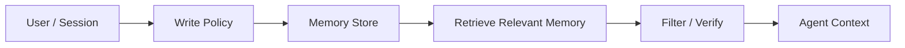

# 长期记忆

长期记忆跨 turns、sessions、users 或 organizations 存储信息。它帮助 Agent 记住 preferences、constraints、decisions 和 durable facts，而不只依赖当前 prompt。

## 什么时候需要记忆？

当回答依赖当前请求之外的信息时，需要长期记忆：

- user preferences；
- prior decisions；
- account constraints；
- project conventions；
- recurring workflows；
- identity 或 role context。

不要用它替代应该来自当前 retrieval、live API 或 verified systems of record 的事实。

## 记忆层次

| Layer | Scope | 例子 | Governance |
| --- | --- | --- | --- |
| Working context | 当前 turn | prompt、tool result、active plan | 自动清除 |
| Session memory | 单次对话 | 当前 chat 中的 preferences | session 后过期 |
| User memory | 单个用户跨时间 | 格式偏好、时区 | 用户可见控制 |
| Org/project memory | 团队或项目 | 规范、runbooks、standards | owner 和 review process |
| Knowledge base | 广泛 evidence | policies、docs、facts | freshness 和 citations |

## 写入策略

写入 memory 前：

- 以后还有用吗？
- 是否 private、sensitive 或 regulated？
- 是 factual 还是 merely inferred？
- 谁拥有这条 memory？
- 用户能否删除或纠正？

保守默认：保存 durable preferences 和 verified facts；避免保存 speculative claims。

## 读取策略

使用 memory 前：

- 是否和当前任务相关？
- 是否 stale？
- 是否和 retrieved evidence 冲突？
- 是否 private 或 role-appropriate？
- 是否需要 citation 或 source link？

Retrieved memory 是 context，不是 authority。Live system of record 应优先于 memory。

## 失败模式

- Agent 把 memory 当成永远为真。
- Stale preference 覆盖了新的 user instruction。
- Private memory 跨 users 或 tenants 泄露。
- Memory store 里保存了 hallucinated facts。
- 没有删除或纠正路径。
- Retrieval 返回 noisy 或 unrelated memories。

## 评估清单

- 系统能否区分 memory、retrieval 和 live tool output？
- 用户能否检查或删除 stored memories？
- Stale memories 是否被 flag 或忽略？
- Cross-tenant access paths 是否测试？
- Memory writes 是否可审计？
- 必要时最终答案是否披露重要 remembered context？

## 深入：生产记忆系统

长期记忆需要 lifecycle control：write、retrieve、update、resolve conflicts、delete、restrict access 和 evaluate。实用记忆栈包括 conversation history、session summary、user/entity memory 和带 citations 的 knowledge base。

Memory record 应包含 owner/scope、source、timestamp、confidence、access policy、last accessed、last verified 和 correction/deletion path。Source strength 很重要：tool results 和 confirmed user statements 强于 model inferences。

## 检索策略

Semantic search 前应先按 tenant/user、role、recency、source type、confidence、verification status 和 task relevance 做 scope。如果 memory 与 live retrieval 或 system of record 冲突，优先使用 live source，并把 memory 标记为 stale。

## 来源

- Letta memory layers: https://docs.letta.com/concepts/memory/levels_of_memory
- Letta long-term memory: https://docs.letta.com/concepts/memory/long-term_memory
- Mem0 documentation: https://docs.mem0.ai/overview
