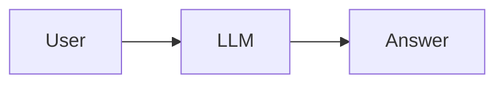
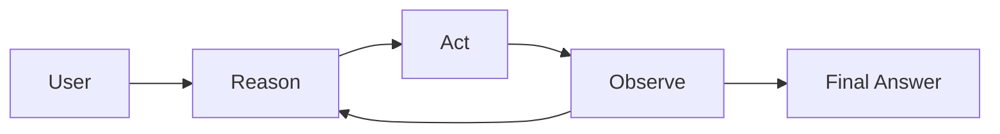
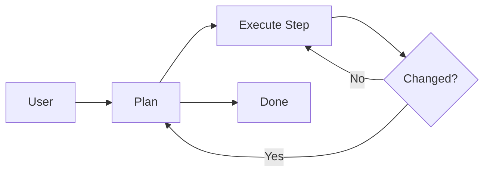
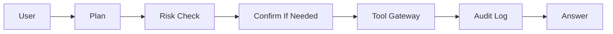
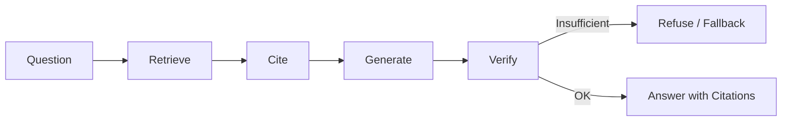
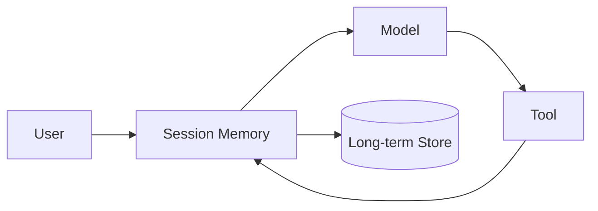
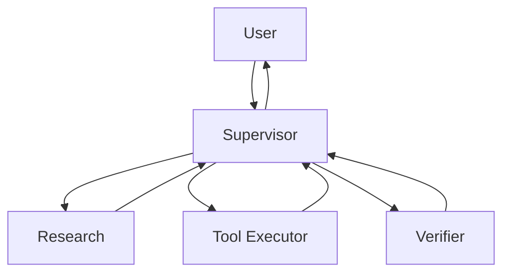
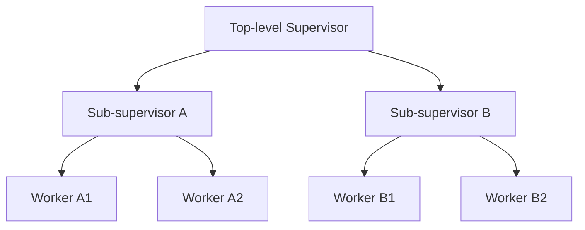
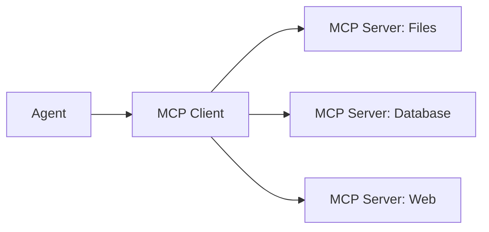
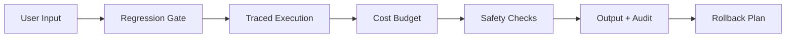

# 架构模式速查

这份速查表用于设计选择，而不是框架清单。原则是选择能满足任务且证据可审计的最小架构。
每个模式列出适用场景、权衡和反模式。

## 模式表

| Pattern | 适用场景 | 避免场景 | 生产检查 |
| --- | --- | --- | --- |
| Single LLM call | 简单回答、无工具 | 需要 evidence 或 action | prompt/version pin、refusal、safety checks |
| ReAct loop | 需要可观测 tool steps | tool results 不可信 | tool schema、max iterations、retry policy、stop condition |
| Plan-and-Execute | 步骤事先已知或重规划成本高 | 任务中途频繁变化 | plan validation、step contracts、replan trigger、cost budget |
| Tool-using Agent / Tool Gateway | 需要外部状态或 side effects | permissions 不清楚 | risk classifier、confirmation、audit log、rollback |
| RAG Agent | 答案依赖私有或当前 docs | corpus stale/untrustworthy | retrieval eval、citations、fallback、source freshness |
| Memory-enhanced Agent | context 跨很多轮或会话 | 每次请求都是无状态 | retention policy、summary quality、privacy checks |
| Supervisor | specialization 和 verification 有帮助 | 单 Agent + tools 就够 | task contracts、verifier、handoff schema、state isolation |
| Hierarchical teams | 任务可分解为多个独立子团队 | 扁平 supervisor 就够 | depth budget、escalation path、result aggregation |
| MCP-based Agent | 需要大量标准 tool server | 一两个自定义工具就够 | schema pinning、server auth、timeouts、rate limits |
| Production Agent | 需要 auth、evals、traces、rollback | 只需要 prototype | regression gate、observability、cost budget、incident runbook |

## 最小决策流程

1. 任务是否需要当前或私有证据？如果是，增加 RAG 和检索评估。
2. 任务是否修改外部状态？如果是，增加工具风险分类和确认。
3. 任务是否需要多个专家或独立验证？如果是，使用 supervisor + 窄职责 worker。
4. 任务是否上生产？如果是，要求 evals、traces、成本限制和 rollback。
5. 如果都不需要，从 single LLM call 开始，并保留明确 refusal path。

## 架构模式

### Single LLM Call

- **适用场景**：直接回答的问题，无工具调用、无私有检索、无不可逆动作。
- **权衡**：最便宜、最好调试，但无法作用于外部世界，也无法验证自己的 claim。
- **反模式**：为了"以防万一"加工具或检索，却让模型在无预算、无策略的情况下自行决定是否使用。
- **生产检查**：锁定 prompt 和模型版本、定义 refusal 行为，并对输出做 safety checks。

### ReAct Loop

- **适用场景**：任务需要可观测、可验证的工具步骤，例如查表、计算或 API 调用。
- **权衡**：灵活，能根据 observation 修正方向，但每一步都增加延迟、成本和失败面。
- **反模式**：没有最大迭代数就运行、盲目信任原始工具输出、或在同一个失败 action 上反复循环。
- **生产检查**：强制最大步数预算、retry policy、stop condition；工具结果缺失或矛盾时走 fail-closed 路径。

### Plan-and-Execute

- **适用场景**：步骤事先已知、重规划成本高，或需要把计划展示给人类审批。
- **权衡**：比每步重规划更便宜、更可预测，但任务中途变化时会很脆弱。
- **反模式**：没有 replan trigger 就执行过期计划，或重规划太频繁导致计划没有价值。
- **生产检查**：用 acceptance criteria 验证计划，给每个 step 定义类型化契约，明确什么变化触发 replan。

### Tool-Using Agent / Tool Gateway

- **适用场景**：任务会改变外部状态，或需要读取有权限要求的系统。
- **权衡**：能力强大且有用，但每个副作用都会扩大 blast radius 和调试成本。
- **反模式**：让模型绕过 validation、权限检查和 audit 直接调用工具。
- **生产检查**：Tool gateway 应负责 validation、permissions、idempotency、retries 和 audit；高风险动作需要 confirmation。

### RAG Agent

- **适用场景**：答案依赖私有、当前或领域特定的文档。
- **权衡**：把答案建立在证据上并支持引用，但增加检索延迟、索引维护和新的失败模式。
- **反模式**：没有 retrieval eval 就做 RAG，或让模型忽略检索 context 继续幻觉。
- **生产检查**：评估 retrieval recall、context relevance、citation correctness、source freshness，以及证据不足时的 refusal。

### Memory-Enhanced Agent

- **适用场景**：任务需要跨很多轮或会话的 context，例如助手、研究线程或迭代工作。
- **权衡**：带来连续性和个性化，但引发保留、隐私、成本和过期问题。
- **反模式**：无限期保存原始 transcript，或把所有内容塞进 context window 直到溢出。
- **生产检查**：明确存什么、存多久、谁能读、如何摘要；测试摘要质量。

### Supervisor

- **适用场景**：工作可划分为多个专业方向，或独立 verifier 能降低风险。
- **权衡**：隔离和验证更好，但延迟、成本和协调复杂度更高。
- **反模式**：为了多 Agent 而多 Agent；supervisor 每步都重新规划；worker 重复劳动。
- **生产检查**：定义 task contracts、handoff schema、verifier 标准和 state isolation；只有当边界能降低风险或提升验证质量时才使用多 Agent。

### Hierarchical Teams

- **适用场景**：任务分解成多个需要各自协调的独立子问题，例如大型研究计划。
- **权衡**：能扩展到大型任务图，但延迟、成本和失败点成倍增加，失败可能跨层级级联。
- **反模式**：小任务用很深的树、升级路径不清晰、子团队结果聚合不一致。
- **生产检查**：限制深度、定义升级到人类的路径、统一子团队结果的聚合与验证方式。

### MCP-Based Agent

- **适用场景**：需要大量标准集成，server 通过共享协议暴露 tools、resources、prompts、schemas 和 context。
- **权衡**：减少 glue code、提高可移植性，但多了一层要调试的协议，也依赖 server 行为。
- **反模式**：以为 MCP 能替代 eval、guardrail 或认证；用未验证的 schema 或没有 timeout 调用 server。
- **生产检查**：锁定 server schema 和版本、对 server 做认证和 rate limit、设置 timeout，并为每个集成的工具跑 eval。

### Production Agent

- **适用场景**：系统服务真实用户，失败有真实成本。
- **权衡**：生产纪律保护用户，但需要投入 evals、observability 和 runbook。
- **反模式**：把 prototype 放到聊天 UI 后面就宣称生产就绪。
- **生产检查**：要求 regression gate、traces、成本限制、rollback 演练和 incident runbook。

## 横切关注点

- **先 eval 后选型**：先定义能证明架构有效的 eval，再选架构，而不是反过来。
- **默认 fail closed**：证据、工具或权限不确定时，拒绝而不是猜测。
- **成本预算放在循环层**：在循环内部执行成本和步数预算，而不只是在 API 网关。
- **状态隔离**：worker 状态保持类型化和作用域化，handoff 不会泄漏或污染 context。
- **人类升级**：每个循环都要有明确停止并向人类求助的点。
- **一切触碰外部的动作都要审计**：记录推理、工具调用、结果和审批。

## 快速审查问题

- 能过 acceptance criteria 的最小架构是什么？
- 哪一部分可以独立评估？
- 哪种失败应该 fail closed，而不是继续 best guess？
- 在请人类介入之前，最大步数和成本预算是多少？
- audit log 在哪里记录 reasoning、tool results 和 approvals？
