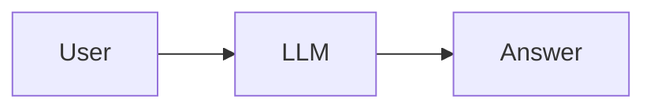
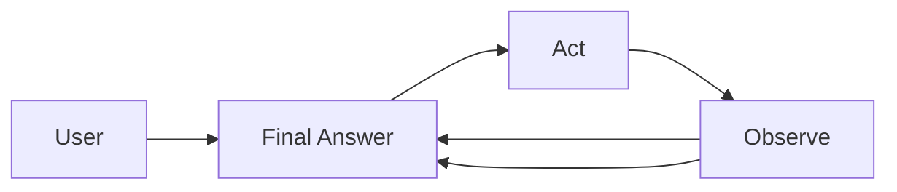
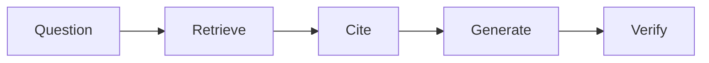
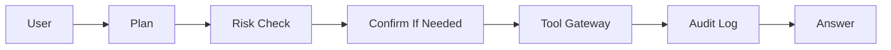
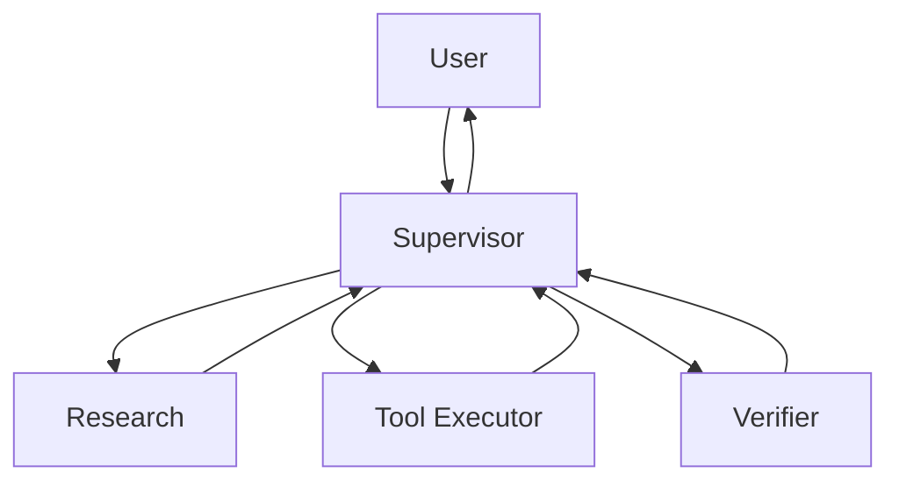

# 架构模式速查

这份速查表用于设计选择，而不是框架清单。原则是选择能满足任务且证据可审计的最小架构。

## 模式表

| Pattern | 适用场景 | 避免场景 | 生产检查 |
| --- | --- | --- | --- |
| Single LLM call | 简单回答、无工具 | 需要 evidence 或 action | prompt/version pin、refusal、safety checks |
| ReAct loop | 需要可观测 tool steps | tool results 不可信 | tool schema、max iterations、retry policy、stop condition |
| RAG Agent | 答案依赖私有或当前 docs | corpus stale/untrustworthy | retrieval eval、citations、fallback、source freshness |
| Tool-using Agent | 需要外部状态或 side effects | permissions 不清楚 | risk classifier、confirmation、audit log、rollback |
| Multi-agent supervisor | specialization 和 verification 有帮助 | 单 Agent + tools 就够 | task contracts、verifier、handoff schema、state isolation |
| Production Agent | 需要 auth、evals、traces、rollback | 只需要 prototype | regression gate、observability、cost budget、incident runbook |

## 最小决策流程

1. 任务是否需要当前或私有证据？如果是，增加 RAG 和检索评估。
2. 任务是否修改外部状态？如果是，增加工具风险分类和确认。
3. 任务是否需要多个专家或独立验证？如果是，使用 supervisor + 窄职责 worker。
4. 任务是否上生产？如果是，要求 evals、traces、成本限制和 rollback。
5. 如果都不需要，从 single LLM call 开始，并保留明确 refusal path。

## 架构模式

### Single LLM Call

只有在无工具调用、无私有检索、无不可逆动作时才保持简单。

### ReAct Loop

循环必须有最大步数和 fail closed 策略，尤其是工具结果缺失或互相矛盾时。

### RAG Agent

RAG 质量不只看模型质量，还要评估 retrieval recall、context relevance、citation correctness 和证据不足时的 refusal。

### Tool-Using Agent

Tool gateway 应负责 validation、permissions、idempotency 和 audit。

### Multi-Agent Supervisor

只有当边界能降低风险或提升验证质量时才使用多 Agent；否则单 Agent + tools 通常更便宜、更好调试。

## 快速审查问题

- 能过 acceptance criteria 的最小架构是什么？
- 哪一部分可以独立评估？
- 哪种失败应该 fail closed，而不是继续 best guess？
