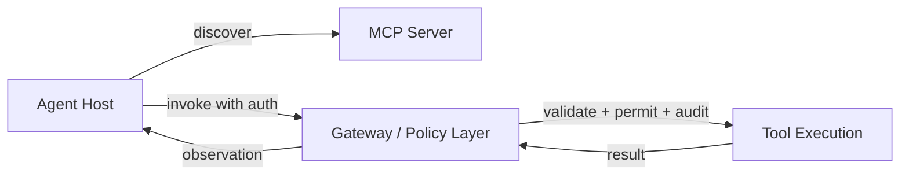

# 工具与 MCP 安全技能卡

## 技能名称

- English: Tool and MCP Safety
- 中文：工具与 MCP 安全边界
- Level: L2-L4

## 目标

帮助工程师通过受控边界暴露外部动作，包括 validation、permissions、confirmation、traces 和 rollback。这项技能把"模型调用了一个函数"变成"系统授权并审计了一个副作用"。

## 适用场景

- Agent 可以读取或写入外部状态。
- Tool call 有 side effects（write、mutate、send、delete）。
- 需要考虑 permissions、idempotency 或 audit。
- 需要解释 tool call 为什么失败，同时不泄露敏感数据。
- 正在通过 MCP server 集成外部能力。

## 不适用场景

- 任务是纯单次 LLM 回答。
- Tool 只读，且 blast radius 可忽略。
- 你只是在学 prompt formatting。

## 核心知识

### 工具契约

每个工具都需要四部分契约：

| 部分 | 回答什么问题 | 示例 |
| --- | --- | --- |
| 输入 | 允许哪些带类型的参数？ | `{ "refund_id": string, "amount_cents": int }` |
| 输出 | 成功以机器可读形式是什么样？ | `{ "ok": true, "refund_id": "R-123" }` |
| 错误 | 失败如何与空结果区分？ | `{ "ok": false, "code": "NOT_FOUND" }` vs `{ "ok": true, "results": [] }` |
| 副作用 | 世界发生了什么变化，可逆吗？ | 产生一笔扣款；24 小时内可逆 |

### 读 / 写 / 破坏性分类

执行前给每个工具分类并附风险等级：

| 风险等级 | 示例 | 默认策略 |
| --- | --- | --- |
| 读 | `search_docs`、`get_balance` | 允许，记录 trace |
| 写 | `update_ticket`、`set_status` | 允许但需校验 + 幂等键 |
| 破坏性 | `delete_account`、`refund`、`send_email` | 需要确认或审批 + 不可变审计 |

分类在代码里，不在 prompt 里。模型提出动作；网关决定应用哪个策略。

### MCP 边界

MCP（Model Context Protocol）标准化了 Agent-工具边界：

- **Host / client**：发现并调用能力的 Agent 运行时。
- **Server**：用 schema、transport 和 auth 暴露 tools、resources、prompts。
- **Tools**：带类型化 schema 的可执行动作。
- **Resources**：host 可加载进上下文的只读数据。
- **Prompts**：server 提供的可复用 prompt 模板。



MCP **本身不是**权限系统。Permissions 和 audit 应在 gateway、server 或 policy layer 里实现。协议传输请求；你的代码授权它。

### 安全属性

一个安全的工具边界有五个属性：

1. **校验**：任何副作用发生前参数符合 schema。
2. **授权**：每个动作检查 actor、role 和 tenant。
3. **确认**：不可逆动作要求 human-in-the-loop。
4. **幂等**：重试不能双重执行副作用。
5. **审计**：每次调用记录 actor、动作、参数、结果和关联 ID。

## 威胁模型

工具边界可能出什么问题：

- **通过工具输出的 prompt injection**：工具返回攻击者文本，指示模型采取破坏性动作。
- **参数走私**：模型用允许的工具名传递非预期参数。
- **重试风暴**：写操作成功后超时，导致双重执行。
- **租户混淆**：缺少 tenant 上下文，动作跑错账户。
- **信息泄露**：错误消息或日志暴露 PII、密钥或内部路径。
- **校验前副作用**：工具先执行，校验后失败，无人察觉。

## 实践证据

- Lab: [`../../../labs/l2/single_agent_mcp/README.md`](../../../labs/l2/single_agent_mcp/README.md)
- Example: [`../../../examples/mcp-tool-boundary/README.md`](../../../examples/mcp-tool-boundary/README.md)
- Case: [`../cases/企业多工具Agent案例.md`](../cases/企业多工具Agent案例.md)
- Project artifact: 带 risk table 和 audit fields 的 tool gateway design note。

## 最小安全网关

```python
def execute_tool(tool_name: str, args: dict, actor: str, tenant: str, idempotency_key: str):
    tool = TOOLS[tool_name]
    risk = tool.risk_class
    if not valid_against_schema(args, tool.schema):
        return {"ok": False, "code": "SCHEMA_ERROR"}
    if not authorize(actor, tenant, tool_name, risk):
        return {"ok": False, "code": "FORBIDDEN"}
    if risk == "destructive" and not human_approved(actor, tool_name, args):
        return {"ok": False, "code": "APPROVAL_REQUIRED"}
    if has_run(idempotency_key):
        return {"ok": True, "cached": True, "result": stored_result(idempotency_key)}
    result = tool.fn(**args)
    store_result(idempotency_key, result)
    audit(tool_name, args, actor, tenant, result, correlation_id)
    return result
```

网关是唯一咽喉：没有 schema 校验、授权、风险策略和审计，任何工具调用都到不了世界。

## 审计日志字段

| 字段 | 示例 | 为什么重要 |
| --- | --- | --- |
| correlation_id | `req_7f3a…` | 关联 trace 与日志 |
| actor | `user:alice` | 谁发起的调用 |
| tenant | `acme` | 划定爆炸半径 |
| tool | `send_email` | 哪个能力 |
| args_hash | `sha256:…` | 不可变参数记录 |
| risk_class | `destructive` | 应用了哪个策略 |
| decision | `approved` / `denied` / `required_confirm` | 网关结果 |
| outcome | `success` / `partial` / `error` | 实际结果 |
| timestamp | `2026-09-17T10:00:00Z` | 排序与审计 |

## 审查问题

1. 执行前如何分类 tool call？—— 按副作用和爆炸半径映射到读/写/破坏性，然后在代码里应用对应策略。
2. Tool result 为空但不是 error 时应怎么处理？—— 视为"无证据"：显式返回空结果，让循环决定收集更多证据或回答无法验证，绝不编造内容。
3. 如何防止同一个 destructive action 执行两次？—— 要求幂等键，存储已执行键并带 TTL，重试时返回原始结果；用测试验证精确一次。
4. 谁决定工具调用是否被允许——模型还是系统？—— 系统。模型提议；网关按 actor、tenant、风险等级和策略授权。
5. 审计日志应记录什么、为什么？—— actor、tenant、工具、参数哈希、风险等级、决策、结果和关联 ID，让每个副作用可回放、可界定、可解释，而不存原始密钥。

## 常见失败模式

- 把 model output 当作授权决策。
- 记录敏感 request payloads（原始参数）而不是哈希。
- Write tool 已成功但响应解析失败后继续 retry。
- Audit log 缺少 tenant 或 actor context。
- 只在 final prompt 里做安全审查。
- 没有幂等键，超时导致双重扣款。
- MCP server 没有 health probe 或超时，挂死循环。

## 生产备注

- 使用 gateway 做 validation、permissions 和 audit。
- 把 rate limits 和 mutation gates 放在 tool execution 附近。
- Side-effecting tools 优先使用 idempotency keys。
- 为 denied、retried、partially successful calls 添加 regression evals。
- 用金丝雀调用按计划探测 MCP server。
- 密钥不进工具描述和日志。

## 相关链接

- Tutorial: [`../L2可靠单Agent与MCP.md`](../L2可靠单Agent与MCP.md)
- Concepts: [`../concepts/MCP模型上下文协议.md`](../concepts/MCP模型上下文协议.md)
- Template: [`../../../templates/Agent技能卡模板.md`](../../../templates/Agent技能卡模板.md)
