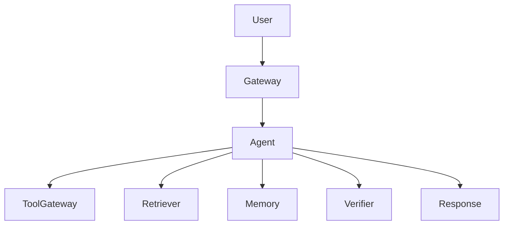

# Agent 设计模板

## 1. 摘要

- 问题：
- 用户：
- 业务目标：
- 非目标：
- 结论：批准 / 有条件批准 / 返工 / 停止

## 2. 需求

- 主要任务：
- 成功指标：
- 必须支持：
- 绝对不能做：
- 预期失败行为：

## 3. 架构

- 系统形态：单次调用 / ReAct / RAG / 工具使用 / 多 Agent
- 为什么这个形态：
- 为什么不再简单些：
- 为什么不再复杂些：

## 4. 边界

| 组件 | 负责人 | 输入 | 输出 | 权限 | 失败模式 |
| --- | --- | --- | --- | --- | --- |
| Gateway |  |  |  |  |  |
| Planner |  |  |  |  |  |
| 工具网关 |  |  |  |  |  |
| 检索器 |  |  |  |  |  |
| 记忆 |  |  |  |  |  |
| 验证器 |  |  |  |  |  |

## 5. 数据源

| 事实类型 | 来源 | 刷新策略 | 需要引用 | 冲突规则 |
| --- | --- | --- | --- | --- |
| 当前指令 | 用户轮次 |  | 否 | 用户指令优先 |
| 私有知识 |  |  |  |  |
| 外部状态 | 工具调用 |  |  |  |
| 记忆 |  |  |  |  |

## 6. 工具

| 工具 | 目的 | 风险 | 权限 | 确认 | 审计字段 |
| --- | --- | --- | --- | --- | --- |
|  |  | 读 / 写 / 破坏性 |  |  |  |

## 7. 安全

- Prompt 注入控制：
- 权限检查：
- 破坏性动作处理：
- 记忆隐私控制：
- 输出校验：
- 人工升级路径：

## 8. 评估

- Golden prompts：
- 负面 / 拒答用例：
- 工具使用用例：
- 检索用例：
- 安全用例：
- 成本 / 延迟用例：
- 回归触发：

## 9. 可观测性

- Request ID：
- 用户 / 租户 ID：
- Prompt / 模型版本：
- Planner 决策：
- 工具调用：
- 检索来源：
- 记忆读写：
- 护栏决策：
- 最终答案状态：
- 成本与延迟：

## 10. 成本与稳定性

- 最大步数：
- 最大工具调用数：
- 最大重试数：
- 延迟预算：
- Token 预算：
- 降级模式：
- 被阻断请求策略：

## 11. 回滚

- Prompt 回滚：
- 模型回滚：
- 工具回滚：
- 检索回滚：
- 记忆回滚：
- 人工复核兜底：

## 12. 上线计划

- 评估门：
- 安全门：
- 可观测门：
- 回滚门：
- 成本 / 延迟门：
- 审批负责人：
- Go / No-go 日期：

## 13. 风险

| 风险 | 可能性 | 影响 | 缓解 | 负责人 |
| --- | --- | --- | --- | --- |
|  |  |  |  |  |

## 14. 决策

- 结论：
- 必需变更：
- 负责人与截止日期：
- 后续 issue：
