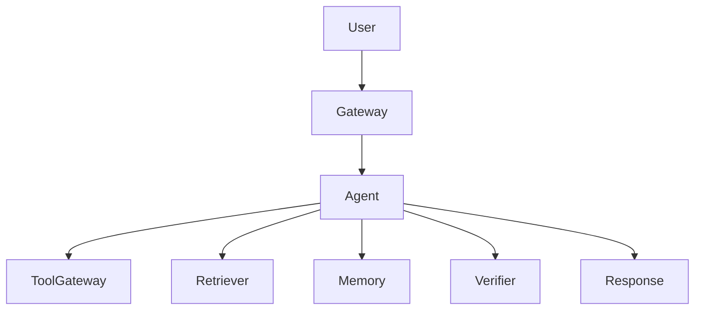

# Agent Design Template

## 1. Summary

- Problem:
- Users:
- Business goal:
- Non-goals:
- Verdict: Approve / Approve with conditions / Rework / Stop

## 2. Requirements

- Primary task:
- Success metric:
- Must support:
- Must not do:
- Expected failure behavior:

## 3. Architecture

- System shape: Single call / ReAct / RAG / Tool-using / Multi-agent
- Why this shape:
- Why not simpler:
- Why not larger:

## 4. Boundaries

| Component | Owner | Input | Output | Permissions | Failure Mode |
| --- | --- | --- | --- | --- | --- |
| Gateway |  |  |  |  |  |
| Planner |  |  |  |  |  |
| Tool gateway |  |  |  |  |  |
| Retriever |  |  |  |  |  |
| Memory |  |  |  |  |  |
| Verifier |  |  |  |  |  |

## 5. Data Sources

| Fact Type | Source | Refresh Policy | Citation Required | Conflict Rule |
| --- | --- | --- | --- | --- |
| Current instruction | User turn |  | No | User instruction wins |
| Private knowledge |  |  |  |  |
| External state | Tool call |  |  |  |
| Memory |  |  |  |  |

## 6. Tools

| Tool | Purpose | Risk | Permission | Confirmation | Audit Fields |
| --- | --- | --- | --- | --- | --- |
|  |  | Read / Write / Destructive |  |  |  |

## 7. Safety

- Prompt injection controls:
- Permission checks:
- Destructive action handling:
- Memory privacy controls:
- Output validation:
- Human escalation path:

## 8. Evaluation

- Golden prompts:
- Negative/no-answer cases:
- Tool-usage cases:
- Retrieval cases:
- Safety cases:
- Cost/latency cases:
- Regression trigger:

## 9. Observability

- Request ID:
- User/tenant ID:
- Prompt/model version:
- Planner decisions:
- Tool calls:
- Retrieval sources:
- Memory reads/writes:
- Guardrail decisions:
- Final answer status:
- Cost and latency:

## 10. Cost and Stability

- Max steps:
- Max tool calls:
- Max retries:
- Latency budget:
- Token budget:
- Degradation mode:
- Blocked request policy:

## 11. Rollback

- Prompt rollback:
- Model rollback:
- Tool rollback:
- Retrieval rollback:
- Memory rollback:
- Human review fallback:

## 12. Launch Plan

- Evaluation gate:
- Safety gate:
- Observability gate:
- Rollback gate:
- Cost/latency gate:
- Approval owner:
- Go/no-go date:

## 13. Risks

| Risk | Likelihood | Impact | Mitigation | Owner |
| --- | --- | --- | --- | --- |
|  |  |  |  |  |

## 14. Decision

- Verdict:
- Required changes:
- Owners and due dates:
- Follow-up issues:
