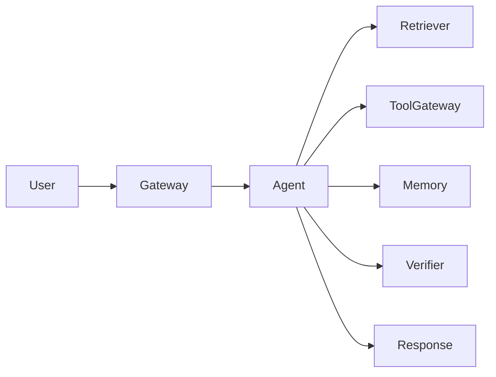

# Agent Case Study Template

## 1. Scenario

- Case name:
- User:
- Business goal:
- Constraints:
- Non-goals:

## 2. Architecture

- System shape:
- Why this shape:
- Main components:
- Data flow:

## 3. Key Decisions

| Decision | Option Chosen | Why | What Was Rejected | Trade-off |
| --- | --- | --- | --- | --- |
|  |  |  |  |  |

## 4. Tools and Evidence

| Tool or Source | Purpose | Risk or Trust Level | Required Evidence |
| --- | --- | --- | --- |
|  |  |  |  |

## 5. Failure Modes

| Failure | Detection | Response | Preventive Eval |
| --- | --- | --- | --- |
|  |  |  |  |

## 6. Evaluation Evidence

| Eval Class | Test Case | Expected Result | Owner |
| --- | --- | --- | --- |
| Golden path |  |  |  |
| Missing evidence |  | Refuse or clarify |  |
| Tool failure |  |  |  |
| Safety attempt |  | Block or escalate |  |

## 7. Production Considerations

- Observability fields:
- Release gates:
- Rollback path:
- Cost and latency budget:
- Human escalation:

## 8. Lessons Learned

- What worked:
- What surprised us:
- What would change:
- Reusable pattern:
