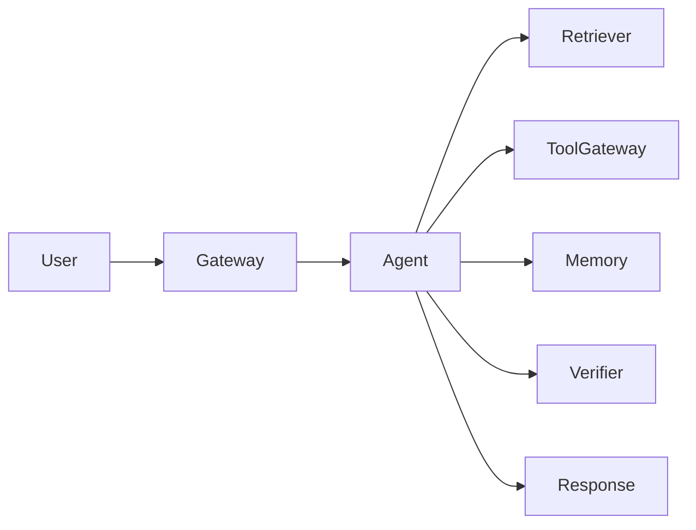

# Agent 案例研究模板

## 1. 场景

- Case name:
- 用户：
- 业务目标：
- 约束：
- Non-goals：

## 2. 架构

- System shape:
- 为什么这样选：
- 主要组件：
- 数据流：

## 3. 关键决策

| Decision | Option Chosen | 为什么 | 被拒绝的方案 | Trade-off |
| --- | --- | --- | --- | --- |
|  |  |  |  |  |

## 4. 工具和证据

| Tool or Source | 用途 | Risk 或 Trust Level | Required Evidence |
| --- | --- | --- | --- |
|  |  |  |  |

## 5. 失败模式

| Failure | Detection | Response | Preventive Eval |
| --- | --- | --- | --- |
|  |  |  |  |

## 6. 评估证据

| Eval Class | Test Case | Expected Result | Owner |
| --- | --- | --- | --- |
| Golden path |  |  |  |
| Missing evidence |  | Refuse or clarify |  |
| Tool failure |  |  |  |
| Safety attempt |  | Block or escalate |  |

## 7. 生产考虑

- Observability fields:
- Release gates:
- Rollback path:
- 成本和延迟预算：
- Human escalation:

## 8. 经验教训

- 什么有效：
- 什么意外：
- 下次如何改：
- 可复用 pattern：
